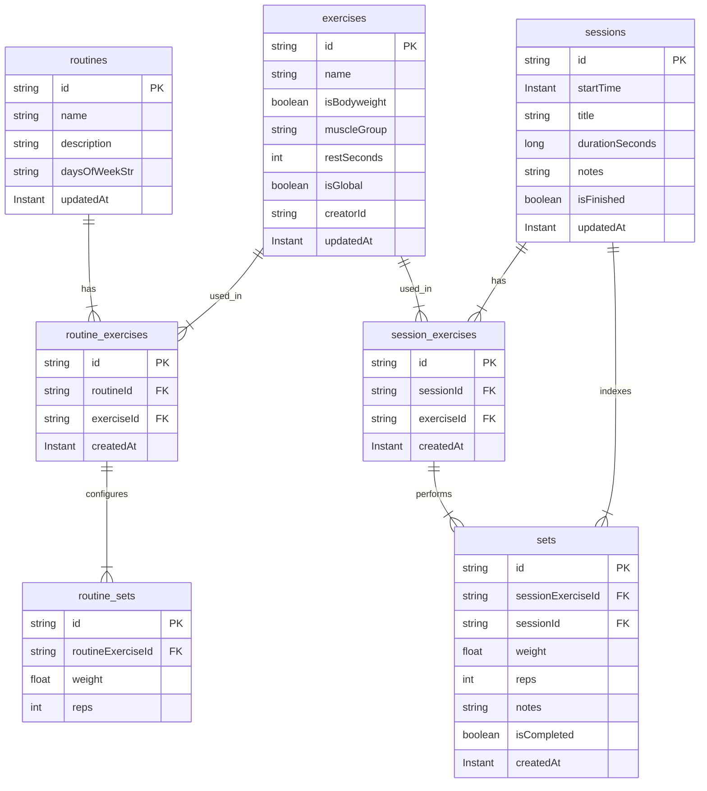
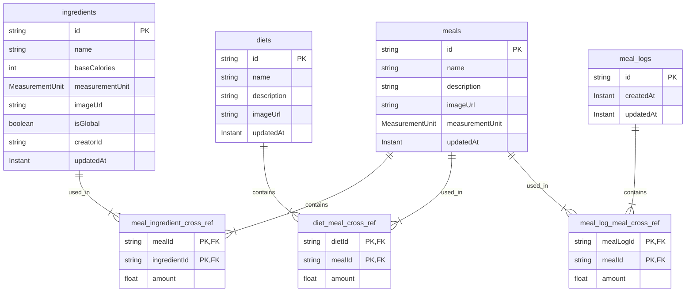
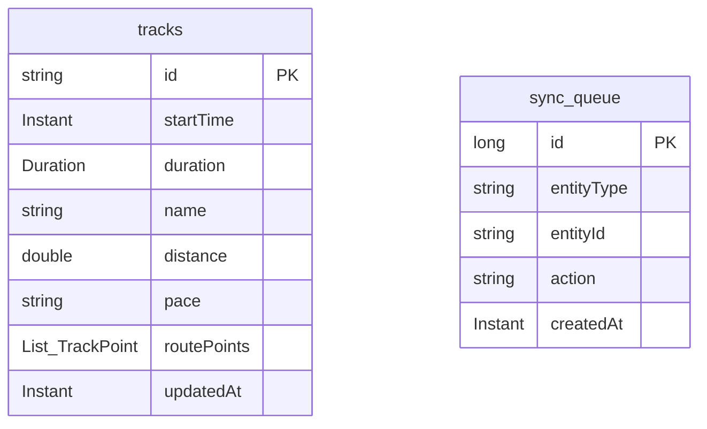
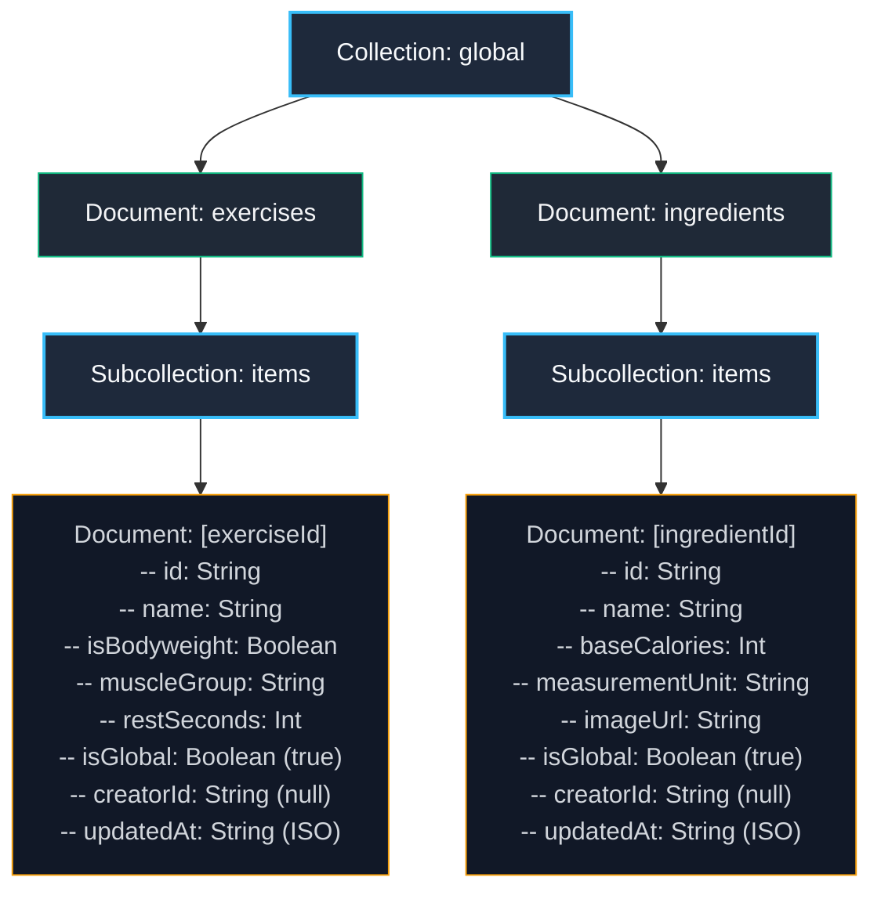
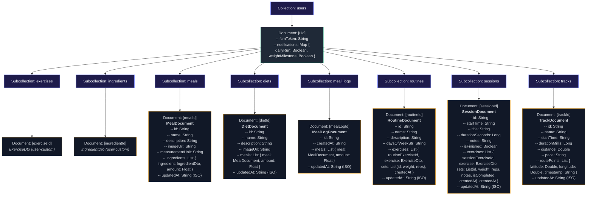

# MinimalFit Database Architecture

This document contains a complete overview and visual schemas of the **MinimalFit** database architecture. It includes both the normalized local SQLite schema (managed by Room) and the denormalized, synchronized Cloud Firestore schema.

---

## 1. Local Database Architecture (Room SQLite)

The local SQLite database (`AppDatabase`) is a fully relational, normalized schema consisting of **16 registered entities** (excluding preferences). Relationships such as Many-to-Many are represented using explicit Junction/Cross-Reference tables.

### 1.1 Complete ER Diagram


---

### 1.2 Isolated Domain Architecture Diagrams

#### A. Gym & Workout Domain (Relational Structure)
Focuses on how workout definitions (Routines) and actual workout executions (Sessions) link with exercises and set trackers.



#### B. Food & Nutrition Domain (Relational Structure)
Shows the normalization of ingredients, compound meals, and diet plans as well as logged nutrition logs.



#### C. Tracking & Sync Infrastructure
Displays the system tables used to store geographical tracks and record changes locally before synchronization with Firestore.



---

## 2. Cloud Firestore Database Architecture

Firestore uses a **document-oriented, hierarchical schema**. To minimize roundtrips and read operations, relationships are **denormalized and embedded directly** within documents as nested arrays or maps.

### 2.1 Firestore Database Tree Folder Structure

Below is the directory tree layout showing exactly how documents and collections are hierarchically organized inside Cloud Firestore:

```text
/ (Firestore Database Root)
├── global (Collection)
│   ├── exercises (Document)
│   │   └── items (Subcollection)
│   │       └── {exerciseId} (Document) -> ExerciseDto
│   └── ingredients (Document)
│       └── items (Subcollection)
│           └── {ingredientId} (Document) -> IngredientDto
└── users (Collection)
    └── {uid} (Document) -> FCM Token, Notification settings map
        ├── exercises (Subcollection)
        │   └── {exerciseId} (Document) -> ExerciseDto (user-defined)
        ├── ingredients (Subcollection)
        │   └── {ingredientId} (Document) -> IngredientDto (user-defined)
        ├── meals (Subcollection)
        │   └── {mealId} (Document) -> MealDocument (denormalized ingredients)
        ├── diets (Subcollection)
        │   └── {dietId} (Document) -> DietDocument (denormalized meals)
        ├── meal_logs (Subcollection)
        │   └── {mealLogId} (Document) -> MealLogDocument (denormalized logged meals)
        ├── routines (Subcollection)
        │   └── {routineId} (Document) -> RoutineDocument (embedded workout configuration tree)
        ├── sessions (Subcollection)
        │   └── {sessionId} (Document) -> SessionDocument (embedded workout execution tree)
        └── tracks (Subcollection)
            └── {trackId} (Document) -> TrackDocument (embedded gps points list)
```

---

### 2.2 Global Shared Firestore Collections

The global collection contains central read-only catalog lookup datasets accessed by all users.



---

### 2.3 Per-User Private Firestore Collections

Private user workspaces are fully partitioned under `users/{uid}` and sync Room changes securely.



---

## 3. Comparison of Local (Room) vs Remote (Firestore) Models

### Relational Normalized vs Nested Denormalized

The synchronization layer (via `SyncScheduler` and repositories) translates Room's normalized tables into nested Firestore documents:

| Component | Local Table Model (Room) | Firestore Document Model (Denormalized) |
| :--- | :--- | :--- |
| **Track** | `tracks` + serialized `List<TrackPoint>` field. | `TrackDocument` containing an array of `TrackPointDto` (lat, lng, ISO timestamp). |
| **Diet** | `diets` $\leftrightarrow$ `diet_meal_cross_ref` $\leftrightarrow$ `meals`. | `DietDocument` inlining an array of `DietMealDto` (which fully inlines each `MealDocument`). |
| **Meal** | `meals` $\leftrightarrow$ `meal_ingredient_cross_ref` $\leftrightarrow$ `ingredients`. | `MealDocument` inlining an array of `MealIngredientDto` (which fully inlines each `IngredientDto`). |
| **Meal Log** | `meal_logs` $\leftrightarrow$ `meal_log_meal_cross_ref` $\leftrightarrow$ `meals`. | `MealLogDocument` inlining an array of `MealLogMealDto` (which fully inlines each `MealDocument`). |
| **Routine** | `routines` $\leftrightarrow$ `routine_exercises` $\leftrightarrow$ `routine_sets`. | `RoutineDocument` containing an array of `RoutineExerciseDto` (each inlines `ExerciseDto` and a nested array of `RoutineSetDto`). |
| **Session** | `sessions` $\leftrightarrow$ `session_exercises` $\leftrightarrow$ `sets`. | `SessionDocument` containing an array of `SessionExerciseDto` (each inlines `ExerciseDto` and a nested array of performance `SetDto`s). |
