# MinimalFit Database Architecture

This document contains a complete overview and visual schemas of the **MinimalFit** database architecture. It includes both the normalized local SQLite schema (managed by Room) and the denormalized, synchronized Cloud Firestore schema.

---

## 1. Local Database Architecture (Room SQLite)

The local SQLite database (`AppDatabase`) is a fully relational, normalized schema consisting of **16 registered entities** (excluding preferences). Relationships such as Many-to-Many are represented using explicit Junction/Cross-Reference tables.

### Room Database ER Diagram

The following diagram maps out all tables, their attributes (keys, data types), and relationships.

```mermaid
erDiagram
    %% ==========================================
    %% FOOD & DIET DOMAIN
    %% ==========================================
    ingredients {
        string id PK
        string name
        int baseCalories
        MeasurementUnit measurementUnit
        string imageUrl
        boolean isGlobal
        string creatorId
        Instant updatedAt
    }

    meals {
        string id PK
        string name
        string description
        string imageUrl
        MeasurementUnit measurementUnit
        Instant updatedAt
    }

    diets {
        string id PK
        string name
        string description
        string imageUrl
        Instant updatedAt
    }

    meal_logs {
        string id PK
        Instant createdAt
        Instant updatedAt
    }

    meal_ingredient_cross_ref {
        string mealId PK, FK
        string ingredientId PK, FK
        float amount
    }

    diet_meal_cross_ref {
        string dietId PK, FK
        string mealId PK, FK
        float amount
    }

    meal_log_meal_cross_ref {
        string mealLogId PK, FK
        string mealId PK, FK
        float amount
    }

    %% ==========================================
    %% GYM & WORKOUT DOMAIN
    %% ==========================================
    exercises {
        string id PK
        string name
        boolean isBodyweight
        string muscleGroup
        int restSeconds
        boolean isGlobal
        string creatorId
        Instant updatedAt
    }

    routines {
        string id PK
        string name
        string description
        string daysOfWeekStr
        Instant updatedAt
    }

    routine_exercises {
        string id PK
        string routineId FK
        string exerciseId FK
        Instant createdAt
    }

    routine_sets {
        string id PK
        string routineExerciseId FK
        float weight
        int reps
    }

    sessions {
        string id PK
        Instant startTime
        string title
        long durationSeconds
        string notes
        boolean isFinished
        Instant updatedAt
    }

    session_exercises {
        string id PK
        string sessionId FK
        string exerciseId FK
        Instant createdAt
    }

    sets {
        string id PK
        string sessionExerciseId FK
        string sessionId FK
        float weight
        int reps
        string notes
        boolean isCompleted
        Instant createdAt
    }

    %% ==========================================
    %% TRACKING & SYNC INFRASTRUCTURE
    %% ==========================================
    tracks {
        string id PK
        Instant startTime
        Duration duration
        string name
        double distance
        string pace
        List_TrackPoint routePoints
        Instant updatedAt
    }

    sync_queue {
        long id PK
        string entityType
        string entityId
        string action
        Instant createdAt
    }

    %% ==========================================
    %% RELATIONSHIPS
    %% ==========================================
    meals ||--|{ meal_ingredient_cross_ref : "contains (1:N)"
    ingredients ||--|{ meal_ingredient_cross_ref : "referenced_in (1:N)"

    diets ||--|{ diet_meal_cross_ref : "contains (1:N)"
    meals ||--|{ diet_meal_cross_ref : "referenced_in (1:N)"

    meal_logs ||--|{ meal_log_meal_cross_ref : "contains (1:N)"
    meals ||--|{ meal_log_meal_cross_ref : "referenced_in (1:N)"

    routines ||--|{ routine_exercises : "has (1:N)"
    exercises ||--|{ routine_exercises : "used_in (1:N)"
    routine_exercises ||--|{ routine_sets : "configures (1:N)"

    sessions ||--|{ session_exercises : "has (1:N)"
    exercises ||--|{ session_exercises : "used_in (1:N)"
    session_exercises ||--|{ sets : "performs (1:N)"
    sessions ||--|{ sets : "indexes (1:N)"
```

---

## 2. Cloud Firestore Database Architecture

Firestore uses a **document-oriented, hierarchical schema**. To minimize roundtrips and read operations, relationships are **denormalized and embedded directly** within documents as nested arrays or maps. 

Firestore is split into two primary roots:
1. **Global Shared Collections** (`/global`): Read-only lookup data populated centrally.
2. **User Personal Collections** (`/users`): Private data partitioned by `uid` and kept synchronized with Room.

### Firestore Architecture Diagram

```mermaid
graph TD
    classDef globalStyle fill:#1e293b,stroke:#38bdf8,stroke-width:2px,color:#f8fafc;
    classDef userStyle fill:#1e1b4b,stroke:#818cf8,stroke-width:2px,color:#f8fafc;
    classDef docStyle fill:#1f2937,stroke:#10b981,stroke-width:1px,color:#f3f4f6;
    classDef schemaStyle fill:#111827,stroke:#f59e0b,stroke-width:1px,color:#d1d5db;

    ROOT((Firestore Root))
    
    %% --- GLOBAL BRANCH ---
    ROOT -->|Shared Data| GLOBAL[Collection: global]:::globalStyle
    
    GLOBAL --> G_EX[Document: exercises]:::docStyle
    G_EX --> G_EX_ITEMS[Subcollection: items]:::globalStyle
    G_EX_ITEMS --> G_EX_DOC["Document: [exerciseId]<br/><i>ExerciseDto</i>"]:::schemaStyle
    
    GLOBAL --> G_ING[Document: ingredients]:::docStyle
    G_ING --> G_ING_ITEMS[Subcollection: items]:::globalStyle
    G_ING_ITEMS --> G_ING_DOC["Document: [ingredientId]<br/><i>IngredientDto</i>"]:::schemaStyle

    %% --- USER BRANCH ---
    ROOT -->|User Isolated Data| USERS[Collection: users]:::userStyle
    USERS --> USER_DOC["Document: [uid]<br/>-- fcmToken: String<br/>-- notifications: Map {dailyRun, weightMilestone}"]:::docStyle

    %% User Subcollections
    USER_DOC --> U_EX[Subcollection: exercises]:::userStyle
    U_EX --> U_EX_DOC["Document: [exerciseId]<br/><i>ExerciseDto</i>"]:::schemaStyle

    USER_DOC --> U_ING[Subcollection: ingredients]:::userStyle
    U_ING --> U_ING_DOC["Document: [ingredientId]<br/><i>IngredientDto</i>"]:::schemaStyle

    USER_DOC --> U_MEALS[Subcollection: meals]:::userStyle
    U_MEALS --> U_MEAL_DOC["Document: [mealId]<br/><i>MealDocument (Denormalized)</i>"]:::schemaStyle

    USER_DOC --> U_DIETS[Subcollection: diets]:::userStyle
    U_DIETS --> U_DIET_DOC["Document: [dietId]<br/><i>DietDocument (Denormalized)</i>"]:::schemaStyle

    USER_DOC --> U_LOGS[Subcollection: meal_logs]:::userStyle
    U_LOGS --> U_LOG_DOC["Document: [mealLogId]<br/><i>MealLogDocument (Denormalized)</i>"]:::schemaStyle

    USER_DOC --> U_ROUTINES[Subcollection: routines]:::userStyle
    U_ROUTINES --> U_ROUTINE_DOC["Document: [routineId]<br/><i>RoutineDocument (Embedded Trees)</i>"]:::schemaStyle

    USER_DOC --> U_SESSIONS[Subcollection: sessions]:::userStyle
    U_SESSIONS --> U_SESSION_DOC["Document: [sessionId]<br/><i>SessionDocument (Embedded Trees)</i>"]:::schemaStyle

    USER_DOC --> U_TRACKS[Subcollection: tracks]:::userStyle
    U_TRACKS --> U_TRACK_DOC["Document: [trackId]<br/><i>TrackDocument (Route Point Array)</i>"]:::schemaStyle
```

---

## 3. Comparison of Local (Room) vs Remote (Firestore) Models

### Relational Normalized vs Nested Denormalized

The synchronization layer (via `SyncScheduler` and repositories) translates Room's normalized tables into nested Firestore documents:

| Component | Local Table Model (Room) | Firestore Document Model (Denormalized) |
| :--- | :--- | :--- |
| **Track** | `tracks` + serialized `List<TrackPoint>` field. | `TrackDocument` containing an array of `TrackPointDto` (lat, lng, ISO timestamp). |
| **Diet** | `diets` $\leftrightarrow$ `diet_meal_cross_ref` $\leftrightarrow$ `meals`. | `DietDocument` inlining an array of `DietMealDto` (which fully inlines each `MealDocument`). |
| **Meal** | `meals` $\leftrightarrow$ `meal_ingredient_cross_ref` $\leftrightarrow$ `ingredients`. | `MealDocument` inlining an array of `MealIngredientDto` (which fully inlines each `IngredientDto`). |
| **Meal Log** | `meal_logs` $\leftrightarrow$ `meal_log_meal_cross_ref` $\leftrightarrow$ `meals`. | `MealLogDocument` inlining an array of `MealLogMealDto` (which fully inlines each `MealDocument`). |
| **Routine** | `routines` $\leftrightarrow$ `routine_exercises` $\leftrightarrow$ `routine_sets`. | `RoutineDocument` containing an array of `RoutineExerciseDto` (each inlines `ExerciseDto` and a nested array of `RoutineSetDto`). |
| **Session** | `sessions` $\leftrightarrow$ `session_exercises` $\leftrightarrow$ `sets`. | `SessionDocument` containing an array of `SessionExerciseDto` (each inlines `ExerciseDto` and a nested array of performance `SetDto`s). |
